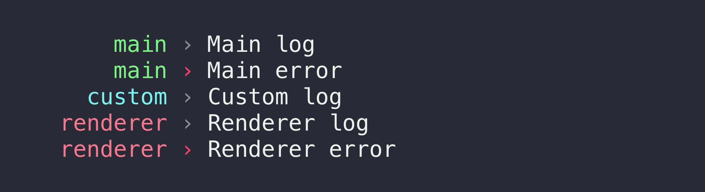

# electron-timber

> Pretty logger for Electron apps



By default, logs from the renderer process don't show up in the terminal. Now they do.

You can use this module directly in both the main and renderer process.


## Install

```
$ npm install electron-timber
```

*Requires Electron 5 or later.*


## Usage

Main process:

```js
const {app, BrowserWindow} = require('electron');
const logger = require('electron-timber');

let mainWindow;

(async () => {
	await app.whenReady();

	mainWindow = new BrowserWindow();
	await mainWindow.loadURL(…);

	logger.log('Main log');
	logger.error('Main error');

	const customLogger = logger.create({name: 'custom'});
	customLogger.log('Custom log');
})();
```

Renderer process:

```js
const logger = require('electron-timber');

logger.log('Renderer log');
logger.error('Renderer error');
```


## API

## logger

Logging will be prefixed with either `main` or `renderer` depending on where it comes from.

Logs from the renderer process only show up if you have required `electron-timber` in the main process.

The methods are bound to the class instance, so you can do: `const log = logger.log; log('Foo');`.

### log(…values)

Like `console.log`.

### warn(…values)

Like `console.warn`.

### error(…values)

Like `console.error`.

### time(label)

Like `console.time`.

### timeEnd(label)

Like `console.timeEnd`.

### streamLog(stream)

Log each line in a [`stream.Readable`](https://nodejs.org/api/stream.html#stream_readable_streams). For example, `child_process.spawn(…).stdout`.

### streamWarn(stream)

Same as `streamLog`, but logs using `console.warn` instead.

### streamError(stream)

Same as `streamLog`, but logs using `console.error` instead.

### create([options])

Create a custom logger instance.

You should initialize this on module load so prefix padding is consistent with the other loggers.

#### options

Type: `object`

##### name

Type: `string`

Name of the logger. Used to prefix the log output. Don't use `main` or `renderer`.

##### ignore

Type `RegExp`

Ignore lines matching the given regex.

##### logLevel

Type: `string`

Can be `info` (log everything), `warn` (log warnings and errors), or `error` (log errors only). Defaults to `info` during development and `warn` in production.

### getDefaults()

Gets the default options (across `main` and `renderer` processes).

### setDefaults([options]) <sup><small>*Main process only*</small></sup>

Sets the default options (across `main` and `renderer` processes).

#### options

Type: `object`

Same as the `options` for `create()`.


## Toggle loggers

You can show the output of only a subset of the loggers using the environment variable `TIMBER_LOGGERS`. Here we show the output of the default `renderer` logger and a custom `unicorn` logger, but not the default `main` logger:

```sh
TIMBER_LOGGERS=renderer,unicorn electron .
```


## Related

- [electron-util](https://github.com/sindresorhus/electron-util) - Useful utilities for developing Electron apps and modules
- [electron-reloader](https://github.com/sindresorhus/electron-reloader) - Simple auto-reloading for Electron apps during development
- [electron-serve](https://github.com/sindresorhus/electron-serve) - Static file serving for Electron apps
- [electron-debug](https://github.com/sindresorhus/electron-debug) - Adds useful debug features to your Electron app
- [electron-context-menu](https://github.com/sindresorhus/electron-context-menu) - Context menu for your Electron app
- [electron-dl](https://github.com/sindresorhus/electron-dl) - Simplified file downloads for your Electron app
- [electron-unhandled](https://github.com/sindresorhus/electron-unhandled) - Catch unhandled errors and promise rejections in your Electron app


## Maintainers

- [Sindre Sorhus](https://github.com/sindresorhus)
- [@acheronfail](https://github.com/acheronfail)


## License

MIT
