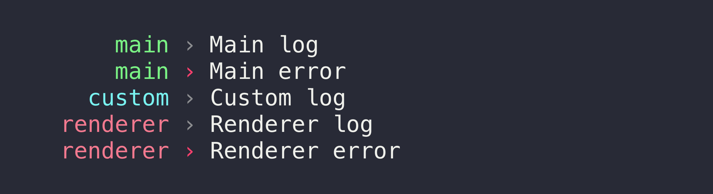

# electron-timber

> Pretty logger for Electron apps



By default, logs from the renderer process don't show up in the terminal. Now they do.

You can use this module directly in both the main and renderer process.

## Install

```sh
npm install electron-timber
```

*Requires Electron 44 or later.*

## Usage

Main process:

```js
import {app, BrowserWindow} from 'electron';
import logger from 'electron-timber';

let mainWindow;

(async () => {
	await app.whenReady();

	mainWindow = new BrowserWindow({
		webPreferences: {
			nodeIntegration: true
		}
	});
	await mainWindow.loadURL(…);

	logger.log('Main log');
	logger.error('Main error');

	const customLogger = logger.create({name: 'custom'});
	customLogger.log('Custom log');
})();
```

Renderer process:

```js
import logger from 'electron-timber';

logger.log('Renderer log');
logger.error('Renderer error');
```

No `preload` setup is needed. The module registers its own preload script via [`session.registerPreloadScript()`](https://www.electronjs.org/docs/latest/api/session#sesregisterpreloadscriptscript) to share defaults with renderers.

Works with bundlers like Vite (including [electron-vite](https://electron-vite.org/)). The renderer entry is browser-only and never bundles Node.js or Electron main-process APIs, so `nodeIntegration` is not required. If your bundler needs it to be explicit, import `electron-timber/renderer` in the renderer and `electron-timber/main` in the main process.

## API

### logger

Logging will be prefixed with either `main` or `renderer` depending on where it comes from.

Logs from the renderer process only show up if you have imported `electron-timber` in the main process.

The methods are bound to the class instance, so you can do: `const log = logger.log; log('Foo');`.

### log(…values)

Like `console.log`.

### warn(…values)

Like `console.warn`.

### error(…values)

Like `console.error`.

### time(label?)

Like `console.time`.

#### label

Type: `string`\
Default: `'default'`

### timeEnd(label?)

Like `console.timeEnd`. Does nothing when no timer with the label is running.

#### label

Type: `string`\
Default: `'default'`

### streamLog(stream)

Log each line in a [`stream.Readable`](https://nodejs.org/api/stream.html#stream_readable_streams). For example, `child_process.spawn(…).stdout`.

### streamWarn(stream)

Same as `streamLog`, but logs using `console.warn` instead.

### streamError(stream)

Same as `streamLog`, but logs using `console.error` instead.

### create(options?)

Create a custom logger instance.

You should initialize this on module load so prefix padding is consistent with the other loggers.

#### options

Type: `object`

##### name

Type: `string`

Name of the logger. Used to prefix the log output. Don't use `main` or `renderer`.

##### ignore

Type: `RegExp`

Ignore lines matching the given regex.

##### logLevel

Type: `string`\
Default: `'info'` when `NODE_ENV` is `'development'`, otherwise `'warn'`

Can be `info` (log everything), `warn` (log warnings and errors), or `error` (log errors only).

##### timestamp

Type: `boolean`\
Default: `false`

Prefix the output with the local time, for example `22:10:34 main › Log`.

Only applies to the terminal output. Renderer logs are printed in the terminal by the main process, so use `setDefaults()` in the main process to add timestamps to them. In DevTools, use the “Show timestamps” setting instead.

```js
logger.setDefaults({timestamp: true});
```

### getDefaults()

Get the default options (across `main` and `renderer` processes).

Note: `logLevel` is returned in its internal numeric form.

### setDefaults(options?) <sup><small>*Main process only*</small></sup>

Set the default options (across `main` and `renderer` processes). Renderer windows are notified automatically.

The `name` option is ignored.

It throws when called from a renderer.

#### options

Type: `object`

Same as the `options` for `create()` (except `name`).

### hookConsole(options?)

Hook console methods (`console.log`, `console.warn`, etc.) to use electron-timber instead.

When called with no arguments, hooks the console in the current process. From the main process, pass `{renderer: true}` to also hook all current and future renderer consoles.

Returns a function to unhook the console methods.

#### options

Type: `object`

##### main

Type: `boolean`\
Default: `true` when called with no arguments from the main process, otherwise `false`

Hook the console in the main process. Only applies in the main process.

##### renderer

Type: `boolean`\
Default: `true` when called with no arguments from a renderer process, otherwise `false`

Hook the console in renderer processes. Can be set from the main process to hook all current and future renderers, or from a renderer to hook itself.

```js
const unhook = logger.hookConsole({
	main: true,
	renderer: true
});

// Later...
unhook();
```

**Note:** Custom loggers created with `create()` do not have access to this method.

## Toggle loggers

You can show the output of only a subset of the loggers using the environment variable `TIMBER_LOGGERS`. It must be set before the module is imported. Here we show the output of the default `renderer` logger and a custom `unicorn` logger, but not the default `main` logger:

```sh
TIMBER_LOGGERS=renderer,unicorn electron .
```

## Colors

Colors are disabled when chalk detects that the output is not a TTY, which happens in some terminals and set-ups even though the output ends up somewhere that renders colors fine (Cmder/ConEmu, mintty, the VS Code debugger, Electron on Windows). Set `FORCE_COLOR=1` to force colors in that case:

```sh
FORCE_COLOR=1 electron .
```

## Related

- [electron-util](https://github.com/sindresorhus/electron-util) - Useful utilities for developing Electron apps and modules
- [electron-reloader](https://github.com/sindresorhus/electron-reloader) - Simple auto-reloading for Electron apps during development
- [electron-serve](https://github.com/sindresorhus/electron-serve) - Static file serving for Electron apps
- [electron-debug](https://github.com/sindresorhus/electron-debug) - Adds useful debug features to your Electron app
- [electron-context-menu](https://github.com/sindresorhus/electron-context-menu) - Context menu for your Electron app
- [electron-dl](https://github.com/sindresorhus/electron-dl) - Simplified file downloads for your Electron app
- [electron-unhandled](https://github.com/sindresorhus/electron-unhandled) - Catch unhandled errors and promise rejections in your Electron app
